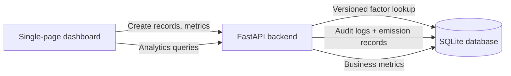

# Carbon Emissions Reporting Platform

Prototype GHG reporting platform for organization that need to capture, analyze, and report Scope 1 and Scope 2 emissions using GHG Protocol style logic.

## Overview

The platform is built around three ideas:

1. Activity data is never calculated against an arbitrary latest factor.
2. Emission factors are versioned with validity dates for historical accuracy.
3. Manual overrides are allowed, but every override is captured in an audit trail.

The core calculation used throughout the app is:

`Activity Data x Emission Factor = GHG Emissions (kgCO2e)`

## Technology Stack

- Backend: FastAPI, SQLAlchemy, SQLite
- Frontend: Vanilla HTML, CSS, JavaScript, Chart.js
- Packaging: Docker, Docker Compose

## Architecture



## Data Model

### `emission_factors`

Master data table for factor management.

- `scope`: Scope 1 or Scope 2
- `category`: Mobile Combustion, Stationary Combustion, Purchased Electricity
- `activity_name`: Diesel, LPG, Grid Electricity
- `activity_unit`: liters, kg, kWh
- `co2e_kg_per_unit`: factor value in kgCO2e per unit
- `factor_source`: source label
- `version_label`: factor version identifier
- `valid_from`, `valid_to`: validity window for historical lookup

### `emission_records`

Stores submitted activity data and the exact factor used.

- `quantity`, `unit`, `activity_date`
- `calculated_kg_co2e`: system-calculated value
- `final_kg_co2e`: final reported value after any override
- `override_applied`: manual override flag
- `emission_factor_id`: foreign key to the factor version used

### `audit_log`

Tracks manual overrides for compliance.

- `emission_record_id`
- `action`
- `field_name`
- `old_value`
- `new_value`
- `reason`

### `business_metrics`

Stores operational metrics used in intensity calculations.

- `metric_date`
- `metric_name`
- `metric_unit`
- `value`

## Historical Accuracy Logic

When an emission record is created, the backend:

1. Filters factors by `scope`, `activity_name`, `activity_unit`
2. Finds factors where `valid_from <= activity_date`
3. Keeps only factors where `valid_to` is null or `valid_to >= activity_date`
4. Selects the most recent valid factor version

This ensures a July 2025 diesel entry uses the 2025 diesel factor even if a 2026 factor exists.

## Seed Data

On startup the app seeds:

- Versioned emission factors for 2024, 2025, and 2026
- Expired factors for prior years to demonstrate historical accuracy
- Business metrics for steel production and employees
- Sample emission records across 2025 and 2026 for analytics

## API Summary

### Operational APIs

- `GET /emissions`
- `POST /emissions`
- `POST /emissions/{record_id}/override`
- `GET /business-metrics`
- `POST /business-metrics`
- `GET /audit-logs`
- `GET /master-data/activity-options`

### Analytics APIs

- `GET /analytics/yoy-emissions?year=2026`
- `GET /analytics/emission-intensity?metric_name=Tons%20of%20Steel%20Produced`
- `GET /analytics/hotspots`
- `GET /analytics/monthly-emissions?year=2026`

## Dashboard Features

The frontend includes:

- Emission submission form for Scope 1 and Scope 2 records
- Business metric submission form
- Stacked bar chart for year-over-year emissions by Scope 1 and Scope 2
- Donut chart for emission hotspots by source
- KPI card for emission intensity
- Line chart for current-year monthly emissions
- Recent records table showing the factor version used
- Audit trail panel for overrides

## Run Locally

### Option 1: Docker Compose

From the project root:

```bash
docker compose up --build
```

Then open:

- Frontend: `http://localhost:3000`
- Backend API docs: `http://localhost:8000/docs`

### Option 2: Run Without Docker

Use two terminals from the project root.

Terminal 1 (backend):

```bash
cd backend
pip install -r requirements.txt
uvicorn app.main:app --reload --host 0.0.0.0 --port 8000
```

Terminal 2 (frontend static server):

```bash
cd frontend
python -m http.server 3000
```

Then open:

- Frontend: `http://127.0.0.1:3000`
- Backend API docs: `http://127.0.0.1:8000/docs`

Notes:

- If you open `frontend/index.html` directly (`file://`), the app now defaults to `http://127.0.0.1:8000` for API calls.
- If port 3000 is busy, run `python -m http.server 5500` and open `http://127.0.0.1:5500`.

## Sample Payloads

### Create Emission Record

```json
{
  "scope": "Scope 1",
  "category": "Mobile Combustion",
  "activity_name": "Diesel",
  "quantity": 1250,
  "unit": "liters",
  "activity_date": "2026-04-15",
  "notes": "Internal fleet diesel consumption"
}
```

### Create Business Metric

```json
{
  "metric_date": "2026-04-30",
  "metric_name": "Tons of Steel Produced",
  "metric_unit": "tons",
  "value": 5700
}
```

### Override Emission

```json
{
  "new_kg_co2e": 2500,
  "reason": "Verified against corrected utility invoice"
}
```

## Verification Performed

- Python syntax compilation across backend and frontend assets
- Backend smoke test for table creation and seed loading.
- API smoke test for:
  - `/health`
  - `/analytics/yoy-emissions`
  - `/analytics/emission-intensity`
  - `/analytics/hotspots`
  - `/master-data/activity-options`
  - emission creation and manual override flow

## Notes

- The current implementation intentionally focuses on Scope 1 and Scope 2 as requested.
- Scope 3 can be added later by extending the master data and analytics grouping logic.
- SQLite is used for simplicity in the prototype, but the schema design is compatible with migration to PostgreSQL.
